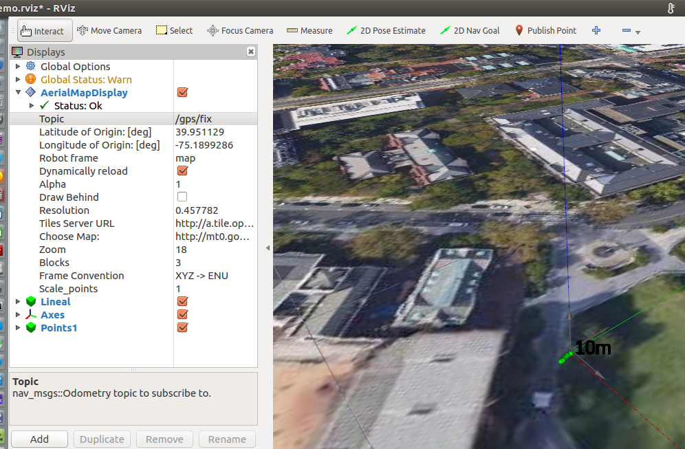

# rviz_maps

## Overview

This package is an adapted version of [rviz_satellite](https://github.com/gareth-cross/rviz_satellite). It extends this version and is able to plot marker points of incoming gps positions. This package is basically a rviz plugin to load tiles from a tile server around a latitude and longitude coordinate and plot gps points as markers of message Type: sensor_msgs/NavSatFix to a topic with name /gps/fix.

**Author: Markus Lamprecht<br />
Maintainer: Markus Lamprecht, 2f4yor@gmail.com<br />**



## Installation

### Dependencies

This software is built on the Robotic Operating System ([ROS]), which needs to be [installed](http://wiki.ros.org) first. Additionally, this package depends on following software:

- [alfons_msgs]
- [cv_bridge]
- [opencv]
- [tf2_ros]

### Building

In order to install this package, clone the latest version from this repository into your catkin workspace and compile the package using [catkin_tools](https://catkin-tools.readthedocs.io/en/latest/)

``` 
mkdir -p catkin_ws/src
cd catkin_ws/src/
git clone git@github.com:CesMak/rviz_maps.git #(takes some time due to included bag to test this package)
cd ..
catkin init -w .
catkin build
source devel/setup.bash
```

## Basic Usage

- Start via: ``` roslaunch rviz_maps demo.launch``` 
- Have a look to the launch file to use the bag file (etc.)
- ** If you do not see the map** -> change the latitute and click enter!

## Main Launch file

``` 
roslaunch rviz_maps demo.launch
``` 

## License BSD
If you want to use this package please contact: [me](https://simact.de/about_me).
Please also consider the License of [rviz_satellite](https://github.com/gareth-cross/rviz_satellite)

## Bugs 
``` 
Errors     << rviz_maps:make /home/markus/ros_space/alfons_ws/logs/rviz_maps/build.make.000.log
In file included from /home/markus/ros_space/alfons_ws/src/alfons/rviz_maps/src/aerialmap_display.cpp:38:0:
/home/markus/ros_space/alfons_ws/src/alfons/rviz_maps/src/aerialmap_display.h:20:53: fatal error: rviz_maps/rviz_scale.h: No such file or directory
compilation terminated.
``` 

**Solution**

* source ws
* try rosmsg show rviz_maps/rviz_scale.msg
* roscd rviz_maps
* catkin build --this
* catkin build

**mapscache is stored in package of different folder**
``` 
  const std::string package_path = ros::package::getPath("rviz_pics");
  if (package_path.empty()) {
    throw std::runtime_error("package 'rviz_pics' not found to create storage folder");
  }

  std::hash<std::string> hash_fn;
  cache_path_ =
      QDir::cleanPath(QString::fromStdString(package_path) + QDir::separator() +
                      QString("mapscache") + QDir::separator() +
                      QString::number(hash_fn(object_uri_)));
``` 

Change storage folder here ^^^

If this does not work change a little thing in the tileloader.cpp file and catkin build again and then it should work.


## TODO's

- Extend GUI to a field for adjusting the topic's name.


[ROS]: http://www.ros.org
[rviz]: http://wiki.ros.org/rviz
[grid_map_msg/GridMap]: https://github.com/anybotics/grid_map/blob/master/grid_map_msg/msg/GridMap.msg
[sensor_msgs/PointCloud2]: http://docs.ros.org/api/sensor_msgs/html/msg/PointCloud2.html
[geometry_msgs/PoseWithCovarianceStamped]: http://docs.ros.org/api/geometry_msgs/html/msg/PoseWithCovarianceStamped.html
[tf/tfMessage]: http://docs.ros.org/kinetic/api/tf/html/msg/tfMessage.html
[std_srvs/Empty]: http://docs.ros.org/api/std_srvs/html/srv/Empty.html
[grid_map_msg/GetGridMap]: https://github.com/anybotics/grid_map/blob/master/grid_map_msg/srv/GetGridMap.srv
[grid_map_msgs/ProcessFile]: https://github.com/ANYbotics/grid_map/blob/master/grid_map_msgs/srv/ProcessFile.srv